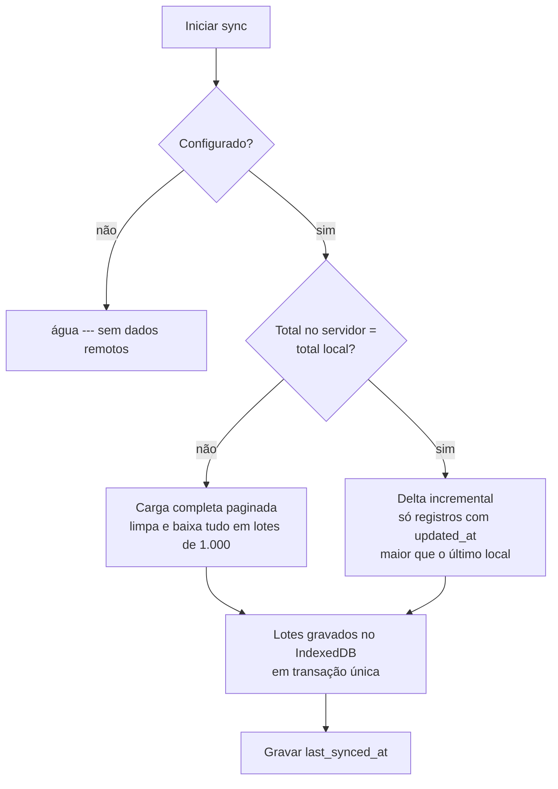

# Hidrante App

Aplicativo **PWA (Progresssive Web App)** de apoio às equipes que executam manutenção em hidrantes urbanos da cidade de São Paulo. O colaborador localiza um hidrante pela identificação, visualiza sua posição no mapa, consulta dados cadastrais e inicia a navegação até o local pelo Google Maps — inclusive sem conexão.

> Status atual: o app é voltado à **consulta e apoio em campo**. A integração com o sistema de manutenção ainda é um objetivo futuro (ver [Roadmap](#roadmap)).

## Sobre o projeto

Para quem executa reparos e vistorias de hidrantes, saber exatamente onde está cada equipamento e chegar até ele é parte fundamental da tarefa. Este projeto resolve duas necessidades principais:

1. **Localizar hidrantes rapidamente** — pela busca pelo número de identificação, ver a localização no mapa e os dados cadastrais (endereço, bairro, distrito, subprefeitura, região, status).
2. **Trabalhar no campo de forma confiável** — os dados ficam armazenados localmente (IndexedDB), permitindo usar o app mesmo sem internet, e o mapa base é cacheado para funcionamento offline.

O aplicativo é alimentado por uma base com **cerca de 5.500 hidrantes** e foi estruturado para evoluir: novas funcionalidades podem ser adicionadas sem reescrever as partes existentes.

## Funcionalidades

Implementadas:

- **Busca de hidrantes por identificação** — campo de busca com sugestões (até 6 resultados) filtradas pelo número do hidrante.
- **Mapa com localização dos hidrantes** — base cartográfica (CARTO) e marcadores; em zoom aproximado, hidrantes próximos são agrupados em clusters; em zoom alto (≥ 16) cada hidrante exibe uma etiqueta com o seu número.
- **Detalhes do hidrante** — ao tocar no hidrante, o mapa centraliza automaticamente e uma folha exibe os dados cadastrais.
- **Navegação pelo Google Maps** — botão "Ir para" abre o Google Maps com a rota até a coordenada do hidrante (ou do marcador).
- **Marcadores de campo** — criação, edição e remoção de marcadores no mapa para registrar pontos importantes identificados em campo (ponto de apoio, obra, reservado, em manutenção, risco, personalizado). A criação parte da ficha do hidrante, ancorando o marcador naquela posição.
- **Funcionamento offline** — aplicativo instalável (PWA) com dados locais em IndexedDB e cache do mapa base; busca e marcadores funcionam sem conexão.
- **Sincronização da base de hidrantes** — atualização automática periódica e manual ("Atualizar agora"), com carregamento incremental e recarga completa quando necessário.
- **Indicador de status** — menu com o estado de sincronização (sincronizando / sincronizado / offline) e horário da última sincronização.

## Tecnologias

| Tecnologia | Papel no projeto |
| --- | --- |
| **React 19** + **TypeScript** | Interface e tipagem estática de todo o código. |
| **Vite 8** | Build, servidor de desenvolvimento e bundling. |
| **PWA** (`vite-plugin-pwa`) | Instalabilidade, atualização automática do service worker e cache offline do aplicativo e do mapa base. |
| **Leaflet** (`leaflet`, `leaflet.markercluster`) | Renderização do mapa, marcadores e agrupamento em clusters. |
| **CARTO basemaps** | Serviço de tiles do mapa base (estilo Positron, sem ícones comerciais). |
| **Supabase** (`@supabase/supabase-js`) | Fonte remota de dados dos hidrantes (Postgres/PostgREST), acesso somente leitura. |
| **Dexie + IndexedDB** (`dexie`, `dexie-react-hooks`) | Armazenamento local offline dos hidrantes e dos marcadores. |
| **GitHub Actions** | Pipeline de build e publicação no GitHub Pages. |

## Arquitetura

O aplicativo não depende da rede para funcionar após a primeira sincronização: o **Supabase** é a fonte oficial dos hidrantes, e o **IndexedDB** (via Dexie) é a fonte local usada por toda a interface. O mapa usa o Leaflet com tiles da CARTO, cacheados pelo service worker.

```mermaid
flowchart LR
    subgraph Servidor
        S[(Supabase\nPostgres / PostgREST)]
    end

    subgraph Navegador (PWA)
        SW[Service Worker\ncache de app e tiles]
        D[(IndexedDB via Dexie\nhidrantes + marcadores + meta)]
        APP["Interface (React/Leaflet)"]
        D --> APP
        SW --> APP
    end

    S -- "sync de hidrantes" --> D
    APP -- "criar/editar/excluir\nmarcador" --> D
```

**Fluxo de sincronização** (`src/services/syncService.ts`):



- Na carga completa, os dados são buscados em **páginas de 1.000 registros** até o fim, evitando o limite do PostgREST.
- No modo incremental, apenas registros com `updated_at` posterior ao último local são baixados.
- Se as contagens local e remota divergirem (primeira instalação, base local incompleta ou registros removidos no servidor), uma recarga completa é feita automaticamente para auto-corrigir.
- A sincronização ocorre **ao abrir o app** e, depois, a cada 60 segundos e quando a conexão é restabelecida; também há o botão **"Atualizar agora"** no menu.

## Funcionamento

Fluxo principal de uso em campo:

1. O colaborador pesquisa o **número do hidrante** na barra de busca.
2. O sistema encontra o hidrante na base local (IndexedDB); nenhuma rede é necessária se os dados já foram sincronizados.
3. O mapa é centralizado na localização do hidrante e a ficha de detalhes é aberta.
4. O colaborador consulta os dados cadastrais (endereço, bairro, distrito, subprefeitura, região, status).
5. O colaborador pode tocar em **"Ir para"**, que abre o Google Maps com a rota até a coordenada.
6. Para registrar um ponto relevante encontrado em campo, o colaborador usa **"Adicionar marcador"** — o marcador é criado na posição do hidrante, com tipo, nome e observações. Marcadores podem ser editados ou removidos depois.

## Estrutura do projeto

```
.
├─ .github/workflows/deploy.yml      # CI: build e deploy no GitHub Pages
├─ public/                           # favicon e ícones do PWA
├─ supabase/migrations/              # SQL de criação e ajustes da tabela de hidrantes
├─ src/
│  ├─ App.tsx                        # Composição: mapa, camadas, busca e folhas (sheets)
│  ├─ main.tsx                       # Entrada do React
│  ├─ ReloadPrompt.tsx               # Aviso de nova versão / pronto para offline (PWA)
│  ├─ components/
│  │  ├─ topbar/TopBar.tsx           # Barra superior: busca + menu de sincronização
│  │  ├─ search/SearchBar.tsx        # Busca de hidrantes por identificação
│  │  ├─ map/
│  │  │  ├─ MapView.tsx              # Mapa Leaflet + tiles CARTO
│  │  │  └─ HydrantLayer.tsx         # Marcadores de hidrantes, clusters, etiquetas, marcadores locais
│  │  ├─ hydrant/                    # Folhas: detalhe do hidrante, editar/ver marcador
│  │  └─ ui/BottomSheet.tsx          # Componente reutilizável de sheet inferior
│  ├─ hooks/                         # React hooks: hidrantes, marcadores e status de sync
│  ├─ lib/
│  │  ├─ db.ts                       # Banco IndexedDB (Dexie) e schema
│  │  ├─ supabase.ts                 # Cliente Supabase (somente leitura)
│  │  ├─ maps.ts                     # Abertura do Google Maps com a coordenada
│  │  ├─ markerTypes.ts              # Tipos e cores dos marcadores
│  │  └─ types.ts                    # Tipos de domínio
│  └─ services/syncService.ts        # Sincronização com o Supabase
├─ vite.config.ts                    # Vite + configuração do PWA/workbox
├─ .env.example                      # Variáveis de ambiente de exemplo
└─ package.json
```

## Instalação e execução

### Pré-requisitos

- **Node.js** 20.19+ ou 22.12+ (o CI usa Node 24).

### Instalação

```bash
npm install
```

### Variáveis de ambiente

Crie um arquivo `.env` na raiz (copie de `.env.example`) com os valores reais:

```
VITE_SUPABASE_URL=https://SEU_PROJETO.supabase.co
VITE_SUPABASE_ANON_KEY=SUA_ANON_KEY
VITE_CARTO_API_KEY=SUA_CARTO_API_KEY
```

> Os valores são injetados no build. **Nunca** versionar o `.env` com valores reais. O CI usa os mesmos nomes como repository secrets no GitHub (ver [Configuração](#configuração)).

### Comandos

```bash
npm run dev       # servidor de desenvolvimento (Vite)
npm run build     # typecheck (tsc -b) + build de produção
npm run lint      # ESLint
npm run preview   # pré-visualiza o build de produção
```

## Configuração

### Supabase

O aplicativo consome a tabela `public.hidrantes` como **fonte oficial dos dados** (somente leitura, via anon key). As migrations estão em `supabase/migrations/` e deixam a base nesta forma:

- **`hidrantes`**
  - `id` — `integer` (identificação do hidrante)
  - `latitude`, `longitude` — `double precision`
  - `tipo`, `bairro`, `distrito`, `subprefeitura`, `regiao`, `endereco` — `text`
  - `ativo` — `text` (identificador de outro sistema, não um booleano)
  - `status_sgz`, `status_bombeiro` — `text`
  - `updated_at` — `timestamptz` (usado na sincronização incremental)

A tabela tem **RLS habilitada** com política de `select` para a role `anon` e índice em `updated_at`.

### Deploy (GitHub Pages)

O workflow `.github/workflows/deploy.yml` builda e publica o app no GitHub Pages a cada push na `main`. Para isso, configure estes repository secrets:

- `VITE_SUPABASE_URL`
- `VITE_SUPABASE_ANON_KEY`
- `VITE_CARTO_API_KEY`

### Mapa base (CARTO)

Os tiles do mapa requerem uma **API key do CARTO**, fornecida pela variável `VITE_CARTO_API_KEY`. Quem rodar o app localmente precisa de uma key própria; ela é embutida no build e também fica cachada offline pelo service worker.

## Banco de dados e sincronização

- **Fonte oficial**: Supabase (`public.hidrantes`).
- **Armazenamento local** (IndexedDB, bd `hidrante-app-db`):
  - `hidrantes` — espelho local da base (chave `id`, índice `updated_at`);
  - `markers` — marcadores criados pelo usuário no dispositivo (não sincronizados com o servidor);
  - `meta` — metadados internos, como o `last_synced_at`.
- **Sincronização**: incremental por `updated_at`, com recarga completa automática quando as contagens divergem; lotes de 1.000 registros. O `last_synced_at` é derivado do maior `updated_at` presente localmente.
- **Sem conexão**: o app continua utilizável com os dados do IndexedDB, o mapa base cacheado e o service worker servindo o aplicativo. Ao voltar a ficar online, a sincronização é retomada sozinha.

## Integrações

| Integração | Tipo | Status |
| --- | --- | --- |
| **Supabase** (PostgREST) | Fonte de dados dos hidrantes, leitura via anon key | Implementada |
| **Google Maps** | Link para rota até a coordenada (`maps/dir` com destino), abrindo o app do Google Maps | Implementada |
| **CARTO basemaps** | Tiles do mapa base com cache offline | Implementada |
| **Sistema de manutenção** | Visualização das ordens de serviço / manutenções no app | **Planejada — não implementada** |

## Roadmap

Implementado:

- Busca e visualização de hidrantes no mapa, com detalhes cadastrais.
- Navegação até o hidrante pelo Google Maps.
- Marcadores de campo (criar, editar, remover).
- Consulta offline e sincronização da base.

Planejado:

- **Integração com o sistema de manutenção** para que os colaboradores visualizem no aplicativo quais manutenções/ordens de serviço precisam executar.
- **Navegação direta a partir das atividades** — partir de uma ordem de serviço e ser levado ao hidrante correspondente.
- **Expansão das funcionalidades de campo** — evolução do apoio às equipes com base no uso real.

## Contribuição

Este é um projeto de desenvolvimento próprio/portfólio, mas contribuições são bem-vindas:

- Reporte problemas ou ideias pelas **issues** do repositório.
- Para mudanças de código, abra um *pull request* descrevendo o problema resolvido. Todo PR deve passar em `npm run lint` e `npm run build` (verifique `tsconfig` com `noUnusedLocals`/`verbatimModuleSyntax` e as regras do ESLint).

## Licença

Nenhuma licença foi definida para este projeto.

## Autor

Desenvolvido por **GabrielJorge19** ([github.com/GabrielJorge19](https://github.com/GabrielJorge19)).